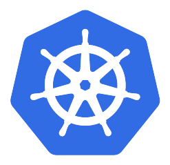
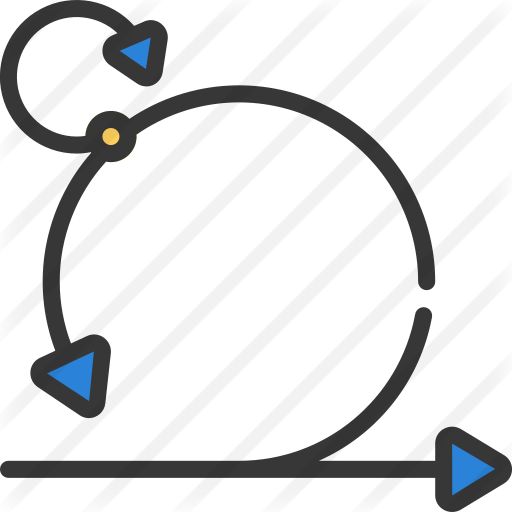

<!-- ) -->
<h1 align="center">Hi 👋, I'm Armand LEOPOLD</h1>
<h3 align="center">Data Factory Manager</h3>

## :man: Whoami

Actuellement je suis Responsable Data Factory à l'Institut Curie.

Je travaille depuis plusieurs années sur la mise en place d'un cadre de développement en utilisant les outils les plus approriés aux besoin, j'assure une veille technologique et intervient en support auprès de celles-ci pour les accompagner au mieux dans l'adoption de ces technologies.

Cet accompagnement se traduit, notamment, par la création et la promotion de Frameworks et librairies internes, d'accompagnement du changement au travers d'atelier et de présentations techniques ou haut niveau.

Je maintiens et fait évoluer la chaîne CI / CD basée sur Gitlab CI.
En supplément de ces pipelines j'ai urbanisé notre plateforme Data sur Kubernetes. Cela me permet de faciliter mon autre rôle qui est de faciliter l'adoption des principes DevOps au sein de ma société.

Je reste un Ingénieur et développeur passionné depuis plus de 12 ans.

### :point_right: Compétences

#### Outils

#### BDD / Providers

#### Langages

#### Frameworks

<a href="https://github.com/anuraghazra/github-readme-stats">
<picture>
<source 
  srcset="https://github-readme-stats.vercel.app/api?username=armandleopold&show_icons=true&theme=dark"
  media="(prefers-color-scheme: dark)"
/>
<source
  srcset="https://github-readme-stats.vercel.app/api?username=armandleopold&show_icons=true"
  media="(prefers-color-scheme: light), (prefers-color-scheme: no-preference)"
/>

</picture>
<!--   
  <picture>
    <source
      srcset="https://github-readme-stats.vercel.app/api/top-langs/?username=armandleopold&theme=dark&card_width=300&langs_count=6&layout=compact&exclude_repo=dotfiles&disable_animations=true" 
      media="(prefers-color-scheme: dark)" 
    />
    <source
      srcset="https://github-readme-stats.vercel.app/api/top-langs/?username=armandleopold&card_width=300&langs_count=6&layout=compact&exclude_repo=dotfiles&disable_animations=true" 
      media="(prefers-color-scheme: light), (prefers-color-scheme: no-preference)" 
    />
    
  </picture> -->
</a>
    

    

        CV détaillé
    

## EXPERIENCE PROFESSIONNELLE

### Oct. 2022 – Aujourd'hui | Responsable Data Factory | Institut Curie

{CDI}

- Animer l'équipe de 6 Data Ingénieurs / Data Scientists, piloter la réalisation des projets scientifiques et collaborations avec les industriels.
- Participer à la valorisation du patrimoine de donnée de l'institut curie.
- Participer à la définition et à la mise en place technique de l'EDS (Entrepôt de Données de Santé) de l'Institut Curie.

### Sept. 2020 – Sept. 2022 | DevOps Engineer | Institut Curie

{CDI}

Merging AUPIC & IDDG Program (see previous position) into one unified technical solution to run the Data Factory globally.
Improving Monitoring, Project and Development Workflows from a technical perspective.

### Mars. 2019 – Aout. 2020 | Data Engineer | Institut Curie

{CDD}

Knowledge in :
CI/CD , DevOps, Cloud, Helm, Kubernetes, Gitlab, health data (Anatomopathology / MRI / PET-SCAN), Talend, Java, Python, Jupyter, Elasticsearch, Docker, Blockchain , Federated AI , Artificial Intelligence. Hyperledger, HTML/CSS/PHP, Maven, Nexus.

- Health Data Metrics : Designing a system to check health data quality of big Datawarehouses.
- AUPIC Program : Creating workflow for integrating continuous integration and continuous deployement with the team. Making presentation, design, programming. Infrastructure as Code, devops.
- IDDG Program : Designing global data workflows with data governance & processing transparency. Creating interoperable database for partnerships with worldwide institutions and organisations.
- SUBSTRA project : Federated machine learning framework for health sector. Working with Owkin

### Oct. 2017 – Feb. 2019 | Data Scientist | THALES

{CDI}

- Applied Data Science & AI to intelligence gathering services. Social network , ROEM, graph algorithms, text mining, NLP, Topic Modelling. Tools : Apache Nifi, CASK Cdap, Elasticsearch, Kibana, Geoserver, JanusGraph, Jupyter Notebook, Kafka, Docker, Python, Scala, Spark.Applied
- Analyse de donnés de vols pour faciliter la maintenance des avions d'une flotte portugaise (A320 family). Tools : Elasticsearch / Jupyter Notebook / Kibana / Docker.
- Traitement, ingestion de plans de vols élaboration de dashboards interactif Kibana pour la DSNA DTI organisme du gouvernement pour la gestion efficace du traffic aérien en France. Tools : Elasticsearch / Jupyter Notebook / Kibana / Docker / Geoserver.

### Sept. 2016 – Sept. 2017 | Data Analyst | Crédit Agricole

{Contrat de Professionnalisation}

Réalisation de scores et d'indicateurs analytiques pour la gestion de la relation client (CRM).
Data mining, machine learning.
Logiciel utilisés : RStudio, Python (Jupyter Notebook), SAS Enterprise Guide & Miner, SAP Business Object.
Fortes compétences en langages : R, Python, SQL, SAS.

### Jun. 2016 – Sept. 2016 | Short Term Researcher | Illinois Institute of Technology

{Stage de Recherche en Université}

BigDataX Laboratory / Computer Science department.
Research subject : Wearable Computing BIG-DATA Architecture.
Made a Research on developping a Big-Data System Architecture for carrying big amount of wearable devices data in stream and storage.
Using Amazon Web Services (AWS) ,Scala, Apache Spark, Apache Cassandra and Android JDK.

### Jun. 2015 – Jun. 2016 | President | Junior Etudes ESIGELEC

{Mandat Associatif}

Restructuration of my school's Junior Enterprise, fiscal rebalancing, archiving and redesigning activity areas, process remodelling and reorganisation.
Managing a 6 people team.
Application to the Junior Entreprises mouvement.
Ability in Team Managment, taxation, legal rules and status, accounting, Project Managment.

### Nov. 2014 – May. 2016 | Full Stack Dev | Freelance

{Mandat Associatif}

Supervisation and developpment of my school's student dedicated website.
Migration to a new responsive and more modern version.
Establishing a communication plan for increasing frequentation and traffic on the site. Improving communication between student inner school organisations
Strong Knowledge in HTML(5) , CSS(3), PHP(5.3 to 7), MySQL, JQuery, Bootstrap, Foundation, Web Design & Development, Analytics.
In 2 years, 3/4 of students subscribed to the website and increasing traffic by thousands of percents.

## FORMATION

### 2014 - 2017 – Diplôme d'Ingénieur – ESIGELEC - Rouen

Ecole d’ingénieur généraliste : Dominante BDTN (Big-Data et Transformation Numérique)
Top classement en informatique : (8/304)
Activités et associations : Club de Musique, Junior Etudes, Club de robotique, Club d'informatique, Club de Théatre.

### 2012 - 2014 : Prépa PCSI/MPSI – ESIGELEC - Rouen

Prépa intégré selection concours Advance.
Major de promotion en Informatique : (1/120)

### 2009 - 2012 : BAC STI Electrotechnique – Lycée Marie Curie à Nogent sur Oise

Niveau : Mention Très Bien (With Honors)
Activités et associations : Délégué en classe de Terminal.

### LANGUES

🇫🇷 🇬🇧

### LOISIRS

Piano, Running, Cinéma, Voyages, Science, Histoire, Géopolitique

