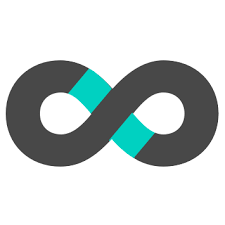
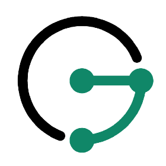

<!-- ) -->
<h1 align="center">Hi 👋, I'm Armand LEOPOLD</h1>
<h3 align="center">Founder @ <a href="https://qalita.io">QALITA</a></h3>

## :man: Whoami

Actuellement je suis Fondateur d'une Start-up spécialisé dans l'assurance qualité des données.

Je reste un Ingénieur et développeur passionné depuis plus de 12 ans.

### :point_right: Compétences

| Domaines | Technologies |
| -------- | ------------ |
| Web | HTML, CSS, PHP, SQL, FastAPI, React, NextJS |
| Data Science | Python, R, SAS, Scikit-Learn, Pandas, Jupyter, Spark |
| Data Engineering | Spark, Airflow, Talend, Kafka, Hadoop, Hive, HDFS, HBase, Cassandra, Elasticsearch, Redis, Janusgraph, Geoserver, Kibana, Jupyter, Docker, Kubernetes, Helm, Terraform, Vault, ArgoCD |
| DevSecOps | Git, Github, Gitlab, Docker, Kubernetes, Helm, Terraform, Vault, ArgoCD, Airflow |
| Dev Tools | VSCode, ChatGPT |
| Design Tools | Figma, Webflow |
| Knowledge / BI / Visualization Tools | Notion, Kibana |
| BDD | MySQL, PostgreSQL, Elasticsearch, Redis, Cassandra, Janusgraph, Geoserver |
| Cloud | AWS, Azure, GCP, OVH |
| Langages | HTML, CSS, PHP, C, Python, R, Scala, Java, React, NextJS |
| Frameworks | DevOps, Scrum |

#### Web

#### Data Science/Engineering/Analysis

#### BDD

#### DevSecOps

#### Cloud

#### Langages

#### Frameworks & Dev Tools

<a href="https://github.com/anuraghazra/github-readme-stats">
<picture>
<source
  srcset="https://github-readme-stats.vercel.app/api?username=armandleopold&show_icons=true&theme=dark"
  media="(prefers-color-scheme: dark)"
/>
<source
  srcset="https://github-readme-stats.vercel.app/api?username=armandleopold&show_icons=true"
  media="(prefers-color-scheme: light), (prefers-color-scheme: no-preference)"
/>

</picture>
</a>

    

        CV détaillé
    

## EXPERIENCE PROFESSIONNELLE

### Avril. 2023 – Aujourd'hui | Fondateur & CEO | QALITA

{CDI}

- Création d'activité Entrepreneuriale
- Prestation de services : gestion de la qualité des données, entrepôts de données de santé.
- Développement d'une Plateforme de gestion de la qualité des données.
- Accompagnement auprès des clients de leur processus de gestion de leurs entrepôts de données.

### Oct. 2022 – Avril. 2023 | Head of Data Factory | Institut Curie

{CDI}

- Animation d'une équipe de 5 Data Ingénieurs / Data Scientist pour piloter la réalisation des projets scientifiques et collaborations avec les industriels
- Participer à la valorisation du patrimoine de donnée de l'institut curie
- Participer à la définition et à la mise en place technique de l'EDS (Entrepôt de Données de Santé)

### Sept. 2020 – Sept. 2022 | DevOps Engineer | Institut Curie

{CDI}

- J'ai guidé et aidé à prendre des décisions stratégiques sur le développement logiciel ou l'architecture technique de la direction des données.
- J'ai mis en place une politique de développement et d'intégration continue en accompagnant mes collègues dans l'utilisation d'outils de versionnage : Git / Gitlab et de pipelines de CI/CD.
- J'ai mis en place une suite de monitoring. Gitlab-monitor, Statuspage, Kibana.
- J'ai partagé la vision et les pratiques devops en menant des présentations internes et externes.
- J'ai assuré la transition et le support sur les outils et pratiques en lien avec la direction des systèmes d'information.

### Mars. 2019 – Aout. 2020 | Data Engineer | Institut Curie

{CDD}

Knowledge in :
CI/CD , DevOps, Cloud, Helm, Kubernetes, Gitlab, health data (Anatomopathology / MRI / PET-SCAN), Talend, Java, Python, Jupyter, Elasticsearch, Docker, Blockchain , Federated AI , Artificial Intelligence. Hyperledger, HTML/CSS/PHP, Maven, Nexus.

- J'ai participé au projet #Healthchain dont ma mission était d'élaborer la base de donnée de curie pour le projet, en récupérant et agrégeant des données cliniques et d'imagerie.
- J'ai échangé avec mes homologues du Centre Léon Bérard pour l'harmonisation sur les formats de données.
- J'ai participé et donner mes retours sur l'intégration d'une plateforme de machine learning fédérée développé par #Owkin, à l'époque jeune startup de moins de 30 personnes.
- J'ai participé aux sujets juridiques de valorisation des modèles de machine learning.
- J'ai participé à la publication dans Nature Medicine d'un article sur une question scientifique utilisant la base de donnée développé.
- J'ai développé un outil de mesure, d'analyse et de contrôle de la qualité des données sur plusieurs bases de donnée dont celle de mon projet.

### Oct. 2017 – Feb. 2019 | Data Scientist | THALES

{CDI}

A Paris - Vélizy :

- J'ai réalisé des travaux d'analyse de graph sociaux à partir de données en sources ouvertes pour les services de renseignements.
- J'ai appliqué des algorithmes d'intelligence artificielles.
- J'ai mené à bien des travaux de traitement du langage naturel.
- J'ai participé à un grand projet de Plateforme de données pour l'armée française, spécifiquement sur la partie cas d'usages et Data Science.

A Toulouse - Labège :

- J'ai analysé des données de vols pour faciliter la maintenance des avions d'une flotte portugaise (A320 family).
- J'ai fais du traitement et de l'ingestion de plans de vols avec élaboration de tableaux de bords interactif Kibana pour la DSNA DTI organisme du gouvernement pour la gestion efficace du trafic aérien en France.

### Sept. 2016 – Sept. 2017 | Data Analyst | Crédit Agricole

{Contrat de Professionnalisation}

- Réalisation de scores et d'indicateurs analytiques pour la gestion de la relation client (CRM).
Data mining, machine learning.
- J'ai eu l'occasion d'aller travailler au DataLab du Crédit Agricole, entité Nationale basée à Montrouge, pour collaborer avec des chercheurs en intelligence artificielle et en traitement de la donnée. A cette occasion, j'ai pu travailler sur une base de panel de consommateurs pour étudier des hypothèses en gestion de relation client, j'ai ensuite fais des retours à ma direction sur ces sujets lors de présentations formelles.

Logiciel utilisés : RStudio, Python (Jupyter Notebook), SAS Enterprise Guide & Miner, SAP Business Object.
Fortes compétences en langages : R, Python, SQL, SAS.

### Jun. 2016 – Sept. 2016 | Short Term Researcher | Illinois Institute of Technology

{Stage de Recherche en Université}

BigDataX Laboratory / Computer Science department.
Research subject : Wearable Computing BIG-DATA Architecture.
Made a Research on developping a Big-Data System Architecture for carrying big amount of wearable devices data in stream and storage.
Using Amazon Web Services (AWS) ,Scala, Apache Spark, Apache Cassandra and Android JDK.

### Jun. 2015 – Jun. 2016 | President | Junior Etudes ESIGELEC

{Mandat Associatif}

Restructuration of my school's Junior Enterprise, fiscal rebalancing, archiving and redesigning activity areas, process remodelling and reorganisation.
Managing a 6 people team.
Application to the Junior Entreprises mouvement.
Ability in Team Managment, taxation, legal rules and status, accounting, Project Managment.

### Nov. 2014 – May. 2016 | Full Stack Dev | Freelance

{Mandat Associatif}

Supervisation and developpment of my school's student dedicated website.
Migration to a new responsive and more modern version.
Establishing a communication plan for increasing frequentation and traffic on the site. Improving communication between student inner school organisations
Strong Knowledge in HTML(5) , CSS(3), PHP(5.3 to 7), MySQL, JQuery, Bootstrap, Foundation, Web Design & Development, Analytics.
In 2 years, 3/4 of students subscribed to the website and increasing traffic by thousands of percents.

## FORMATION

### 2014 - 2017 – Diplôme d'Ingénieur – ESIGELEC - Rouen

Ecole d’ingénieur généraliste : Dominante BDTN (Big-Data et Transformation Numérique)
Top classement en informatique : (8/304)
Activités et associations : Club de Musique, Junior Etudes, Club de robotique, Club d'informatique, Club de Théatre.

### 2012 - 2014 : Prépa PCSI/MPSI – ESIGELEC - Rouen

Prépa intégré selection concours Advance.
Major de promotion en Informatique : (1/120)

### 2009 - 2012 : BAC STI Electrotechnique – Lycée Marie Curie à Nogent sur Oise

Niveau : Mention Très Bien (With Honors)
Activités et associations : Délégué en classe de Terminal.

### LANGUES

🇫🇷 🇬🇧

### LOISIRS

Piano, Running, Cinéma, Voyages, Science, Histoire, Géopolitique

