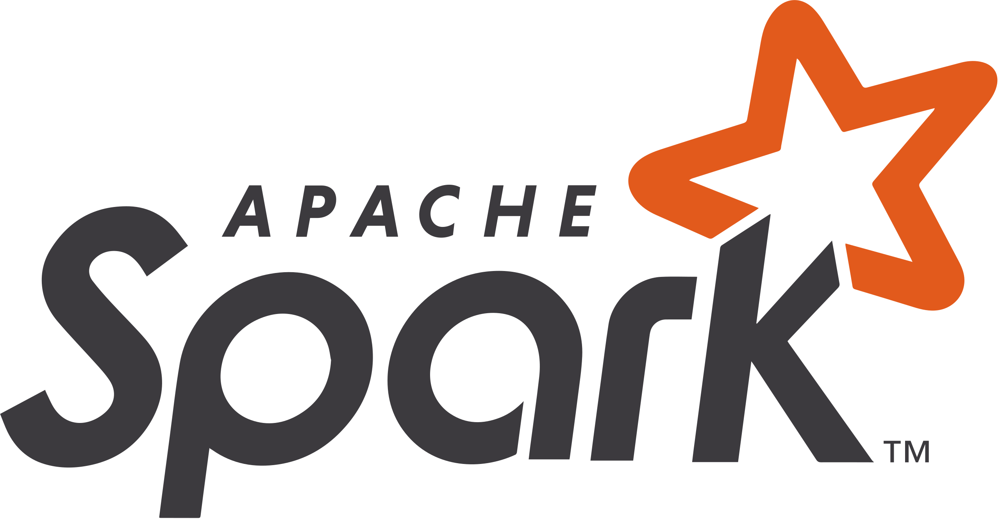
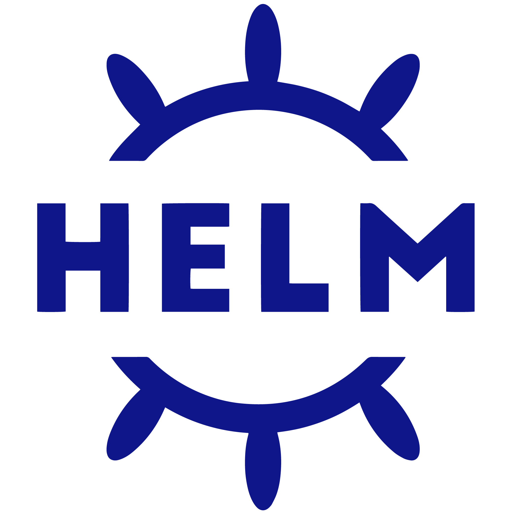

<!-- ) -->
<h1 align="center">Hi 👋, I'm Armand LEOPOLD</h1>
<h3 align="center">Engineer, Founder & CEO @<a href="https://qalita.io">QALITA</a></h3>

## :man: Whoami

I'm currently the founder of a company specializing in data quality assurance.

I've been a passionate engineer and developer for over 15 years.

### :point_right: Hard Skills

| Domains | Technologies |
| -------- | ------------ |
| Web | HTML, CSS, PHP, SQL, FastAPI, React, NextJS |
| Data Science | Python, R, SAS, Scikit-Learn, Pandas, Jupyter, Spark |
| Data Engineering | Spark, Airflow, Talend, Kafka, Hadoop, Hive, HDFS, HBase, Cassandra, Elasticsearch, Redis, Janusgraph, Geoserver, Kibana, Jupyter, Docker, Kubernetes, Helm, Terraform, Vault, ArgoCD |
| DevSecOps | Git, Github, Gitlab, Docker, Kubernetes, Helm, Terraform, Vault, ArgoCD, Airflow |
| Dev Tools | VSCode, ChatGPT |
| Design Tools | Figma, Webflow |
| Knowledge / BI / Visualization Tools | Notion, Kibana |
| BDD | MySQL, PostgreSQL, Elasticsearch, Redis, Cassandra, Janusgraph, Geoserver |
| Cloud | AWS, Azure, GCP, OVH |
| Langages | HTML, CSS, PHP, C, Python, R, Scala, Java, React, NextJS |
| Frameworks | DevOps, Scrum |

#### Web

#### Data Science/Engineering/Analysis

#### BDD

#### DevSecOps

#### Cloud

#### Langages

#### Frameworks & Dev Tools

<a href="https://github.com/anuraghazra/github-readme-stats">
<picture>
<source
  srcset="https://github-readme-stats.vercel.app/api?username=armandleopold&show_icons=true&theme=dark"
  media="(prefers-color-scheme: dark)"
/>
<source
  srcset="https://github-readme-stats.vercel.app/api?username=armandleopold&show_icons=true"
  media="(prefers-color-scheme: light), (prefers-color-scheme: no-preference)"
/>

</picture>
</a>

    

        Detailed Resume
    

## PROFESSIONAL EXPERIENCE

### Apr. 2023 – Present | Founder & CEO | QALITA

{Permanent contract}

* Founded an entrepreneurial venture.
* Provided consulting services in data quality management and healthcare data warehouses.
* Developed a data quality management platform.
* Supported clients in managing their healthcare data warehouse processes.

### Oct. 2022 – Apr. 2023 | Head of Data Factory | Institut Curie

{Permanent contract}

* Led a team of 5 Data Engineers / Data Scientists to deliver scientific projects and industrial collaborations.
* Contributed to the valorization of Institut Curie’s data assets.
* Participated in defining and implementing the technical aspects of the Health Data Warehouse (EDS).

### Sept. 2020 – Sept. 2022 | DevOps Engineer | Institut Curie

{Permanent contract}

* Provided strategic guidance on software development and technical architecture within the Data Department.
* Established development and continuous integration policies, supported colleagues in using version control tools (Git / GitLab) and CI/CD pipelines.
* Implemented a monitoring suite: GitLab-monitor, Statuspage, Kibana.
* Promoted DevOps vision and practices through internal and external presentations.
* Ensured transition and support for tools and practices in coordination with the IT Department.

### Mar. 2019 – Aug. 2020 | Data Engineer | Institut Curie

{Fixed-term contract}

Expertise in:
CI/CD, DevOps, Cloud, Helm, Kubernetes, GitLab, healthcare data (Anatomopathology / MRI / PET-SCAN), Talend, Java, Python, Jupyter, Elasticsearch, Docker, Blockchain, Federated AI, Artificial Intelligence, Hyperledger, HTML/CSS/PHP, Maven, Nexus.

* Contributed to the #Healthchain project by designing a clinical and imaging data warehouse for Curie.
* Collaborated with peers at Centre Léon Bérard to harmonize data formats.
* Provided feedback on the integration of a federated machine learning platform developed by #Owkin (then a young startup with fewer than 30 employees).
* Contributed to legal discussions on machine learning model valorization.
* Co-authored a publication in *Nature Medicine* based on the developed database.
* Developed a tool to measure, analyze, and control data quality across multiple datasets, including the project database.

### Oct. 2017 – Feb. 2019 | Data Scientist | THALES

{Permanent contract}

**In Paris – Vélizy:**

* Conducted social graph analysis using open-source data for intelligence services.
* Applied artificial intelligence algorithms.
* Performed natural language processing tasks.
* Contributed to a major data platform project for the French army, focusing on use cases and Data Science components.

**In Toulouse – Labège:**

* Analyzed flight data to optimize aircraft maintenance for a Portuguese airline (A320 family).
* Processed and ingested flight plans, created interactive dashboards using Kibana for DSNA DTI (French air traffic management authority).

### Sept. 2016 – Sept. 2017 | Data Analyst | Crédit Agricole

{Work-study contract}

* Created analytical scores and indicators for customer relationship management (CRM).
* Worked on data mining and machine learning projects.
* Participated in the Crédit Agricole DataLab in Montrouge, collaborating with AI and data researchers.
* Analyzed a consumer panel database to test CRM hypotheses and formally presented findings to the management team.

**Tools used:** RStudio, Python (Jupyter Notebook), SAS Enterprise Guide & Miner, SAP BusinessObjects

**Strong skills in:** R, Python, SQL, SAS

### Jun. 2016 – Sept. 2016 | Short-Term Researcher | Illinois Institute of Technology

{University Research Internship}

BigDataX Laboratory – Computer Science Department

**Research topic:** Wearable Computing Big Data Architecture

Researched and developed a Big Data architecture to handle high-volume wearable device data for streaming and storage.

**Technologies used:** AWS, Scala, Apache Spark, Apache Cassandra, Android JDK

### Jun. 2015 – Jun. 2016 | President | Junior Enterprise ESIGELEC

{Student Organization Mandate}

Restructured the school’s Junior Enterprise: financial recovery, archiving, activity redesign, process reengineering, and team reorganization.
Managed a team of 6.
Applied to the National Junior Enterprise Network.
Developed skills in team management, taxation, legal compliance, accounting, and project management.

### Nov. 2014 – May. 2016 | Full Stack Developer | Freelance

{Student Organization Mandate}

Supervised and developed the school’s student-dedicated website.
Led the migration to a responsive, modern version.
Established a communication plan to boost engagement and traffic.
Improved inter-organization communication within the student body.

**Technical stack:** HTML5, CSS3, PHP (5.3–7), MySQL, jQuery, Bootstrap, Foundation

**Results:** 75% student adoption and traffic increase by several thousand percent.

---

## EDUCATION

### 2014 – 2017 | Engineering Degree – ESIGELEC, Rouen, France

Generalist engineering school – Major in Big Data & Digital Transformation (BDTN)
Top-ranking in Computer Science: 8th / 304
Activities: Music Club, Junior Enterprise, Robotics Club, Computer Science Club, Theater Club

### 2012 – 2014 | Preparatory Classes PCSI/MPSI – ESIGELEC, Rouen

Integrated preparatory program through the Advance competitive exam.
Top of class in Computer Science: 1st / 120

### 2009 – 2012 | STI Baccalauréat in Electrotechnics – Lycée Marie Curie, Nogent-sur-Oise

Graduated with Honors (Mention Très Bien)
Class representative in final year

---

## LANGUAGES

🇫🇷 French – Native
🇬🇧 English – Professional proficiency

---

## INTERESTS

Piano, Running, Cinema, Travel, Science, History, Geopolitics

